# TwinCAT 3 Event Logger

**A decoupled, scan-cycle-safe event/alarm logging framework for industrial PLCs — built in IEC 61131-3 (Structured Text) on Beckhoff TwinCAT 3.**

[]()
[-orange)]()
[]()
[]()

## At a Glance

- 🏗️ **Interface-driven architecture** — the logger doesn't know or care *how* events get stored. Today it's CSV; swap in a database, OPC UA, or MQTT backend without touching the logging logic.
- ⏱️ **Non-blocking, scan-cycle-safe file I/O** — a `CASE`-based state machine drives `FB_FileOpen` / `FB_FilePuts` across scan cycles instead of blocking the PLC task, the way production alarm systems have to.
- 🧱 **Object-oriented Structured Text** — function blocks, `PUBLIC` / `PRIVATE` methods, a constructor-style `FB_init` for dependency injection, and a formal `INTERFACE`.
- 🛡️ **Overflow-protected buffer** — a fixed 100-slot event array with an explicit `IsBufferFull` guard, so a runaway event source can't overrun memory.
- 📄 **Structured event model** — type (Alarm/Message), severity, identity, timestamp and free text, the same shape used by real SCADA/HMI alarm & event logs.

## Table of Contents

- [Overview](#overview)
- [Architecture](#architecture)
- [Project Structure](#project-structure)
- [Core Components](#core-components)
  - [1. Data Model](#1-data-model)
  - [2. eventLogger Function Block](#2-eventlogger-function-block)
  - [3. Persistence Layer](#3-persistence-layer)
  - [4. MAIN Program](#4-main-program)
  - [5. Timestamp Utility](#5-timestamp-utility)
- [How It Works](#how-it-works)
- [Tech Stack](#tech-stack)
- [Getting Started](#getting-started)
- [Roadmap](#roadmap)
- [Author](#author)

## Overview

This project is a lightweight **event/alarm logging system** for Beckhoff TwinCAT 3, written in IEC 61131-3 Structured Text. It captures structured events (alarms and messages, each with a severity, an identity code, free text and a timestamp) from anywhere in a PLC program and persists them to disk as CSV.

The goal wasn't just "log some data" — it was to apply patterns that matter in real industrial software:

- Keep the *logging logic* completely independent from the *storage mechanism* (interface + dependency injection), so the persistence backend can be swapped without touching the logger.
- Never block the PLC's cyclic task while doing file I/O — file operations are driven through an explicit state machine instead of a single blocking call.
- Protect the runtime buffer from overflow instead of assuming every event will be consumed in time.

## Architecture

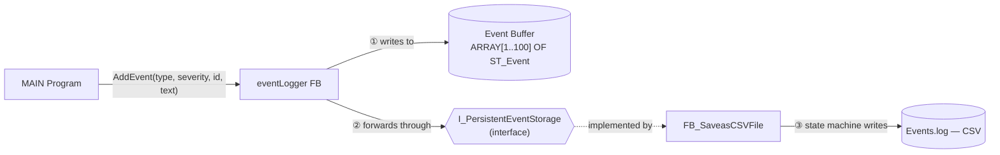

`eventLogger` never references `FB_SaveasCSVFile` directly — it only knows about the `I_PersistentEventStorage` interface, injected through its constructor (`FB_init`). Swap the CSV implementation for a SQL, OPC UA, or MQTT one, and the logger itself doesn't change.

## Project Structure

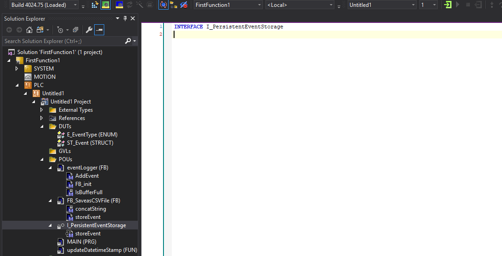

```
FirstFunction1/
└── PLC/Untitled1/Untitled1 Project/
    ├── DUTs/
    │   ├── E_EventType (ENUM)
    │   └── ST_Event (STRUCT)
    ├── POUs/
    │   ├── eventLogger (FB)
    │   │   ├── AddEvent
    │   │   ├── FB_init
    │   │   └── IsBufferFull
    │   ├── FB_SaveasCSVFile (FB)
    │   │   ├── concatString
    │   │   └── storeEvent
    │   ├── I_PersistentEventStorage (INTERFACE)
    │   │   └── storeEvent
    │   ├── MAIN (PRG)
    │   └── updateDatetimeStamp (FUN)
```

## Core Components

### 1. Data Model

`ST_Event` is the shape of every logged event; `E_EventType` distinguishes an `Alarm` from a `Message`.

<p float="left">
  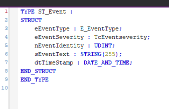
  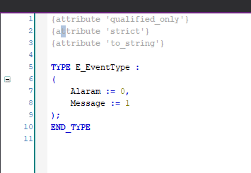
</p>

```st
TYPE ST_Event :
STRUCT
    eEventType     : E_EventType;
    eEventSeverity : TcEventSeverity;
    nEventIdentity : UDINT;
    sEventText     : STRING(255);
    dtTimeStamp    : DATE_AND_TIME;
END_STRUCT
END_TYPE
```

### 2. eventLogger Function Block

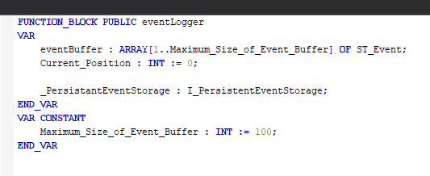

Holds a fixed-size buffer (`ARRAY[1..100] OF ST_Event`) and a reference to whatever persistence strategy was injected at construction.

**Constructor / dependency injection — `FB_init`**

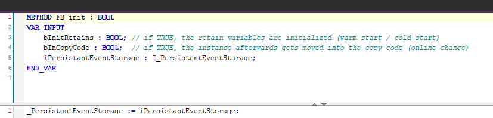

`FB_init` accepts an `I_PersistentEventStorage` instance and stores it. This is the dependency-injection point: `MAIN` decides *what* gets used to persist events, `eventLogger` just uses it.

**`AddEvent`** — public entry point for logging a new event

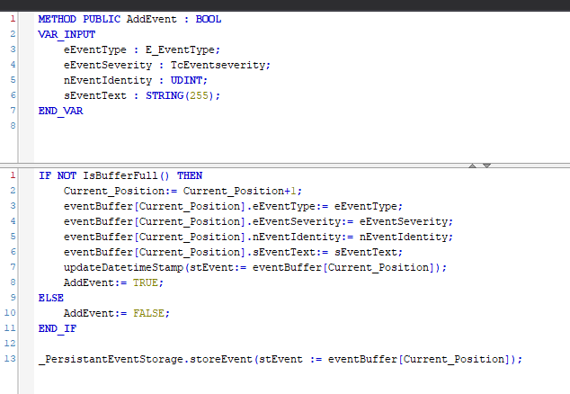

Checks the buffer isn't full, appends the event, stamps it with the current time, and forwards it to the injected storage strategy.

**`IsBufferFull`** — private overflow guard

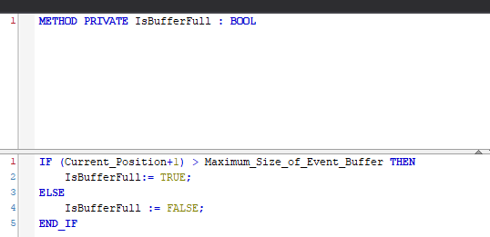

### 3. Persistence Layer

`I_PersistentEventStorage` is a one-method interface (`storeEvent`) — the contract the logger depends on. `FB_SaveasCSVFile` is the concrete implementation used today.

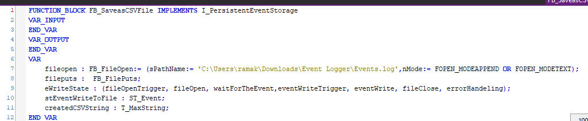

**Non-blocking file-write state machine**

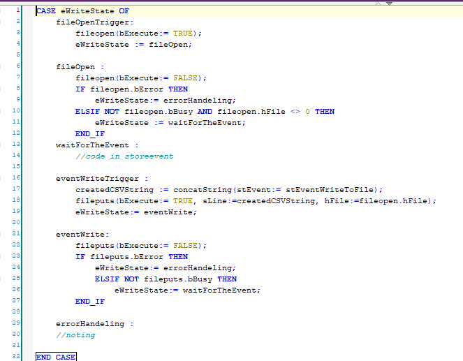

```st
CASE eWriteState OF
    fileOpenTrigger   : (* trigger FB_FileOpen *)
    fileOpen          : (* wait for open to finish, handle errors *)
    waitForTheEvent   : (* idle — new events arrive via storeEvent() *)
    eventWriteTrigger : (* serialize event to CSV, trigger FB_FilePuts *)
    eventWrite        : (* wait for write to finish, handle errors *)
    errorHandeling    : (* recovery hook *)
END_CASE
```

Because it's state-driven instead of blocking, this runs safely inside a normal PLC scan cycle — no loops waiting on I/O to complete.

**`concatString`** — serializes an `ST_Event` into a CSV line

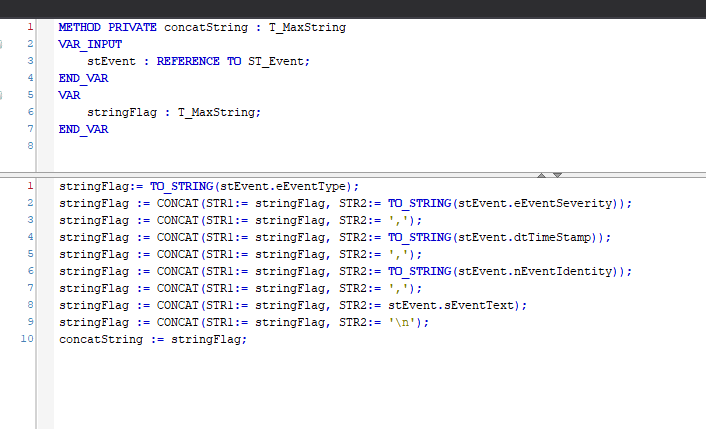

**`storeEvent`** — the interface implementation; only accepts a new event when the state machine is idle

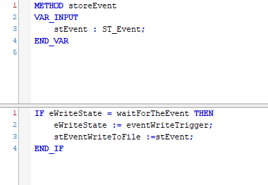

### 4. MAIN Program

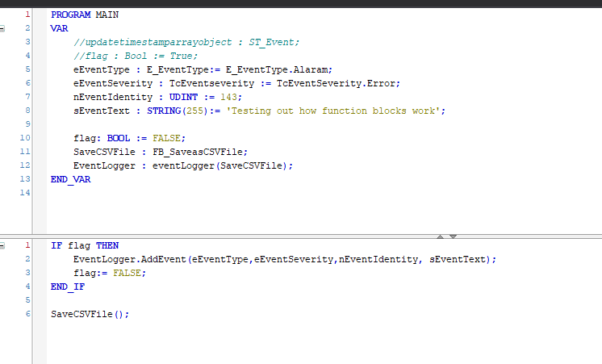

Shows the whole thing wired together: a `FB_SaveasCSVFile` instance is created and injected into `eventLogger` at construction, then `AddEvent()` is called to log a sample alarm.

### 5. Timestamp Utility

`updateDatetimeStamp` reads the system clock via `GETSYSTEMTIME` and converts it into a `DATE_AND_TIME` value on the event.

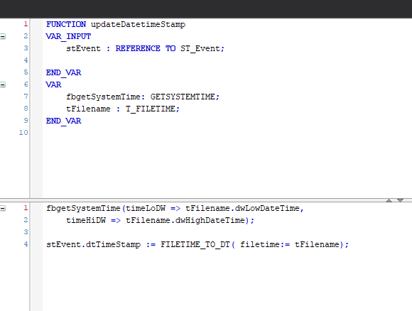

## How It Works

1. Somewhere in the PLC program, code calls `EventLogger.AddEvent(eventType, severity, identity, text)`.
2. `eventLogger` checks the buffer isn't full, appends the event, and stamps it with the current time.
3. `eventLogger` forwards the event to whatever implements `I_PersistentEventStorage` — today, `FB_SaveasCSVFile`.
4. `FB_SaveasCSVFile` accepts the event only if its internal state machine is idle, then serializes it to CSV and writes it to `Events.log` across one or more scan cycles.

## Tech Stack

| Category | Details |
|---|---|
| PLC Runtime | Beckhoff TwinCAT 3 |
| Language | IEC 61131-3 — Structured Text (ST) |
| Paradigm | Object-oriented ST (function blocks, interfaces, methods) |
| Persistence | CSV via `FB_FileOpen` / `FB_FilePuts` |
| Patterns | Dependency Injection, Strategy, State Machine |

## Getting Started

1. Open the solution in TwinCAT 3 (XAE).
2. Build and activate the configuration.
3. In `MAIN`, set `flag := TRUE` to fire a sample event.
4. Check `Events.log` at the configured path for the CSV output.

## Roadmap

Honest next steps if this were headed to production:

- [ ] Make the event buffer circular (overwrite the oldest entry instead of locking out new events once full)
- [ ] Only forward to `storeEvent` on a *successful* `AddEvent` — currently the forwarding call sits outside the success/fail branch
- [ ] Move the hardcoded log file path into a configurable `GVL` / parameter
- [ ] Add a second `I_PersistentEventStorage` implementation (e.g. OPC UA or a database) to prove out the strategy pattern
- [ ] Add TcUnit tests around buffer overflow and the CSV state machine

## Author

**Ramakrishna Tikka**
M.Sc. Mechatronics & Robotics — Hochschule Schmalkalden, Germany
Focus: Battery analytics, embedded systems, industrial automation

[LinkedIn](#) · [Email](#) · [GitHub](#)
